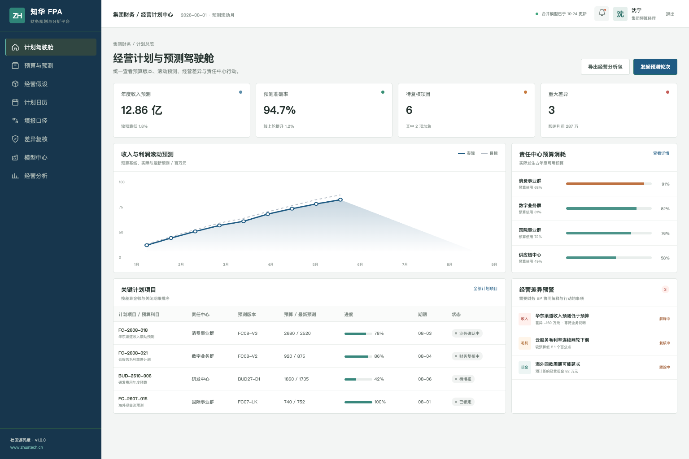
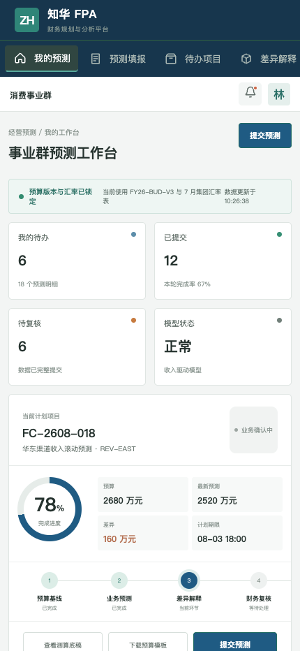

# ZhuaTech FPA｜知华科技财务规划与分析平台

> 让年度预算、滚动预测、经营差异和管理行动建立在同一套数字之上。

[知华科技官网](https://www.zhuatech.cn/) · [部署指南](deploy/README.md) · [API 文档](docs/api.md) · [使用许可](LICENSE)

ZhuaTech FPA 是知华科技（上海如静知华信息科技有限公司）发布的财务规划与分析社区源码版。项目采用 Java + Vue 前后端分离架构，包含集团管理端和业务财务 BP 移动工作台，适合作为预算系统、滚动预测系统和经营分析平台的学习参考。

## 从管理层视角看计划

管理端将预算版本、收入利润预测、责任中心负荷、重大差异与行动计划放入同一驾驶舱。



## 从业务财务视角完成预测

H5 工作台覆盖预测填报、差异解释、模型参数、风险上报和财务复核。



## 业务闭环

```text
战略目标 → 年度预算 → 经营驱动 → 滚动预测 → 差异解释 → 管理行动 → 版本锁定
```

- 多组织预算、预测轮次与版本管理
- 收入、成本、费用、利润与现金流驱动模型
- 责任中心填报、审批、锁版和审计轨迹
- 预算对比、实际对比、情景模拟与差异归因
- 管理行动跟踪及经营分析看板

演示中的组织、金额、指标与人员均为虚构数据。

## 工程结构

| 模块 | 技术 |
| --- | --- |
| 后端 API | Java 21、Spring Boot、Spring Security、JWT、JPA、Flyway |
| 管理端 / H5 | Vue 3、Pinia、Vue Router、Axios、Vite |
| 数据存储 | MySQL 8；H2 集成测试 |
| 部署 | Docker Compose、Nginx、环境变量 |

Java 包名为 `cn.zhuatech.fpa`，数据库名为 `zhuatech_fpa`。

## 本地体验

```bash
cd frontend
npm install
npm run dev:demo
```

浏览器访问 `http://localhost:5173`。管理端账号 `planner / Demo@2026`，业务端账号 `operator / Demo@2026`。完整环境可执行 `cp .env.example .env && docker compose up --build`。

## 使用边界与商务合作

本工程仅允许个人学习、研究和非商业技术交流，**不得商用**。企业内部使用、生产部署、SaaS、项目交付、收费培训、咨询实施、品牌替换或商业再分发，均须事先取得上海如静知华信息科技有限公司书面授权，具体以 [LICENSE](LICENSE) 为准。

预算管理、业财一体化、合并计划、ERP 集成、私有化部署及深度定制，请访问[知华科技官网](https://www.zhuatech.cn/)或扫码咨询：

| 微信咨询一 | 微信咨询二 |
| --- | --- |
|  |  |

关键词：FPA 系统源码、财务规划分析、预算管理系统、滚动预测、经营分析、Java FPA、Vue 预算系统、知华科技。

## 全年滚动预测

新增 `POST /api/fpa/insights/rolling-forecast`，汇总年初至今实际、剩余承诺和预测支出，计算全年预计、预算偏差率并输出 `ON_PLAN`、`WATCH` 或 `REFORECAST`，辅助月度经营分析。
